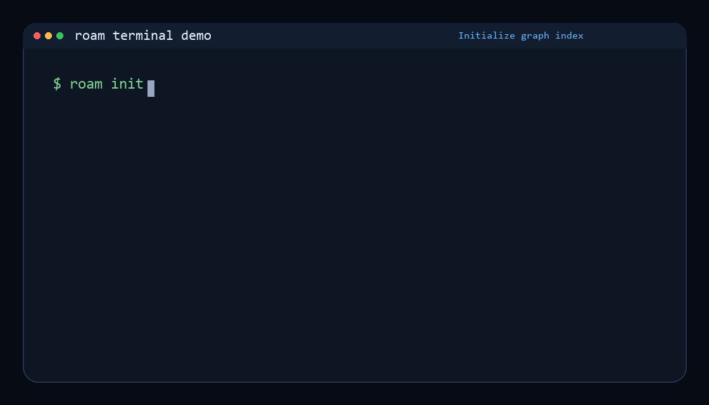

<div align="center">

# roam-code

**The local codebase intelligence layer that lets AI coding agents earn the right to change code — with evidence for what was checked.**

[](https://pypi.org/project/roam-code/)
[](https://github.com/Cranot/roam-code/stargazers)
[](https://github.com/Cranot/roam-code/actions/workflows/roam-ci.yml)
[](https://www.python.org/downloads/)
[](https://opensource.org/licenses/Apache-2.0)

<sub>Credential-free · local analysis with no automatic source-code or telemetry upload · tamper-evident `ChangeEvidence` packets · Apache 2.0 · runs on your machine</sub>

<!-- BEGIN auto-count:readme-headline-counts -->
<sub>285 commands · 244 MCP tools (17 in the default `core` preset) · 28 languages</sub>
<!-- END auto-count:readme-headline-counts -->

<sub><a href="https://roam-code.com/pricing"><b>Paid layers →</b></a> &nbsp;<b>PR Replay</b> audit $2,500 Team / $6,000 Deep, available now &nbsp;·&nbsp; <b>Roam Review</b> from $99/mo flat — no per-seat pricing &nbsp;·&nbsp; <b>Roam Cloud</b> $19/repo/mo &nbsp;·&nbsp; Review and Cloud are early access. The CLI below is Apache 2.0 and free forever.</sub>



</div>

---

**Jump to** —
[Why Roam](#why-roam-is-different) ·
[Install](#install--first-four-commands) ·
[The Compiler](#the-compiler--your-agents-first-token-already-knows-the-answer) ·
[Core commands](#core-commands) ·
[MCP server](#mcp-server) ·
[AI-tool integration](#integration-with-ai-coding-tools) ·
[Roam Guard (PR gate)](#roam-guard-for-prs) ·
[Performance](#performance) ·
[Compare](#how-roam-compares) ·
[Pricing](#paid-layers-free-cli-stays-apache-20) ·
[FAQ](#faq)

---

## Why Roam is different

[METR](https://metr.org/notes/2026-03-10-many-swe-bench-passing-prs-would-not-be-merged-into-main/) and [FrontierCode](https://cognition.ai/blog/frontier-code) both point at the same gap: passing tests is not the same as mergeable code. Roam is an **agent-first CLI surface** that gives the agent local graph facts before it edits, gates risky changes, and emits scoped evidence after the run. In the agent/review tools surveyed as of 2026-06-12, the differentiator is this combination:

- **Credential-free.** No account, no API key, no cloud login. `pip install` and run.
- **Local analysis with an explicit network boundary.** Source parsing, indexes, findings, and evidence generation stay on the machine; Roam sends no automatic telemetry or update checks. A cold `tree-sitter-language-pack` grammar cache downloads one checksum-verified platform bundle and retains it locally. Additional network-capable commands and flags are opt-in and inventoried in [`docs/network-boundary.md`](docs/network-boundary.md), including their destinations and payload classes.
- **Tamper-evident `ChangeEvidence` packets.** A Roam-guided change can compile into one portable packet — HMAC-chained run ledger + signed Code Graph Attestation + signed PR bundle — answering eight questions: *who acted, what authority existed, what context was read, what changed, what could break, what policy applied, what verified it, who accepted risk*. PR Replay maps those eight questions today: structural change/risk/policy axes are in scope, context and verification are partial, and missing identity/authority/approval evidence is disclosed instead of invented. Cursor logs the run; Roam records and verifies the evidence its producers captured.
- **MCP runtime security at the wrapper boundary.** Every MCP response is scrubbed for secrets on egress, gated against the active mode (`read_only` / `safe_edit` / `migration` / `autonomous_pr`) with a closed-enum `policy_decision`, and each decision receipt is HMAC-linked into the signed run ledger. Inside-server controls; the gateway layer (Interlock / Lasso / Portkey) composes on top — see [`dev/MCP-SECURITY-POSTURE.md`](dev/MCP-SECURITY-POSTURE.md).

Underneath sits a SQLite-backed graph of symbols, calls, imports, layers, git history, runtime traces, smells, clones, security flows, and algorithmic patterns across 28 languages — the same local facts queried before, during, and after a change.

**Dependency-aware, not string-based.** Roam knows `Flask` has 47 dependents and 31 affected tests; `grep` knows it appears 847 times. One command replaces 5-10 tool calls, with terminal-friendly UTF-8 output and `--json` / `--sarif` envelopes for agents and CI. See [Performance](#performance) for timings.

|  | Without Roam | With Roam |
|--|-------------|-----------|
| Tool calls | 8 | **1** |
| Wall time | ~11s | **<0.5s** |
| Tokens consumed | ~15,000 | **~3,000** |

*Illustrative — a typical agent workflow on a 200-file Python project (Flask). Reproducible smoke transcript in [`docs/fresh-install-smoke.md`](docs/fresh-install-smoke.md); OSS benchmark harness in [`benchmarks/oss-eval/`](benchmarks/oss-eval/). Exact numbers vary with repo size, host, agent prompt, and model.*

---

## Install + first four commands

About two minutes from `pip install` to a verdict on whether your next edit is safe.

```bash
pip install "roam-code[mcp]"          # 1. install with MCP server for Claude Code / Cursor / Continue
cd /path/to/your/repo
roam init                             # 2. index the repo into .roam/index.db (one-time, ~30s on most repos)
roam health                           # 3. composite 0-100 score: complexity, cycles, dark-matter coupling, dead code
roam preflight <symbol>               # 4. blast radius + tests + complexity + architecture rules before you edit
```

Python 3.10+. `pipx install roam-code` and `uv tool install roam-code` work too. Drop `[mcp]` for CLI-only. See [`docs/fresh-install-smoke.md`](docs/fresh-install-smoke.md) for a verbatim transcript of these four commands against a clean venv.

Step 4 is the payoff — `roam preflight` on a hot symbol returns a verdict before you touch it:

```text
$ roam preflight open_db
VERDICT: Significant risk — CRITICAL, 17922 symbols in blast radius

Pre-flight check for `open_db (src/roam/db/connection.py:1076)`:

  Blast radius:     17922 symbols in 1732 files              [CRITICAL]
  Affected tests:   681 direct, 14126 transitive             [OK]
  Complexity:       cc=5, nest=2                             [LOW]
  Coupling:         2 files often change together            [MEDIUM]
  Conventions:      no violations                            [OK]
  Fitness:          target passes; 1 rule(s) fail on sibling symbols [OK]

  Overall risk: CRITICAL
  Risk driver:  blast radius (17922 symbols in 1732 files, CRITICAL)
```

*An agent sees the blast radius before it edits — not after the tests fail.*

<details>
<summary><strong>Alternate install methods + Docker</strong></summary>

```bash
pipx install roam-code                                   # isolated environment (recommended)
uv tool install roam-code                                # uv-managed tool
pip install git+https://github.com/Cranot/roam-code.git  # from source

# Docker (python:3.12-slim-bookworm base)
docker build -t roam-code .
docker run --rm -v "$PWD:/workspace" roam-code index
docker run --rm -v "$PWD:/workspace" roam-code health
```

Works on Linux, macOS, and Windows. **Windows:** if `roam` is not found after installing with `uv`, run `uv tool update-shell` and restart your terminal.

</details>

---

## The Compiler — your agent's first token already knows the answer

You ask your agent *"who calls `handleSave`?"* and watch it grep, open
three files, grep again, read a fourth — six turns and $1.30 later you get
the answer the repo's call graph held all along.

Roam ships a **task compiler** that ends that loop. Before your prompt
reaches the model, roam recognizes what kind of question it is, runs the
right code-graph lookups locally (~90 ms, zero model calls), and puts the
*answers* into the prompt: the caller list with line numbers, the git
history already filtered, the source around the bug line you cited. The
agent's first words can be the answer.

For Claude Code it's **one command, zero configuration**:

```bash
pip install "roam-code[mcp]"
cd your-repo && roam init
roam hooks claude --write     # compile-before + verify-after, wired into Claude Code
```

Then use `claude` exactly as you always do. Undo anytime with
`roam hooks claude --uninstall --write`. Compile-time context injection is
fail-open. After an edited turn, the Stop gate is deliberately fail-closed:
findings, malformed output, an unavailable check, or incomplete evidence must
be resolved before Claude reports completion. No-edit Q&A turns fast-exit.

**What that buys you, measured head-to-head on Claude** (same prompts, same
repo, with and without the compiler — June 2026, 41 cells):

| Median per task | vanilla | compiled | delta |
|---|---|---|---|
| Agent turns (navigation/comprehension) | 6 | 1 | **−83%** |
| Input tokens | 271K | 53K | **−80%** |
| Cost | $1.30 | $0.48 | **−63%** |
| Wall time | — | — | **−50%** |

A second run on Opus shows the same direction at smaller magnitude (−33%
turns overall; the best single cell hit −88%). And the compiler knows
where it *doesn't* help: prompts that ask the agent to **write** code get
no envelope at all — injection there was measured as pure overhead, so it
spends your tokens only where it wins.

<details>
<summary><b>The full data</b> — every bench cell (including the losses), the ground-truth bug bench, and routing stats</summary>

| Task | turns | input tokens | cost |
|---|---|---|---|
| "where is `open_db` defined?" | 3 → **1** | 156K → 51K | $0.67 → $0.28 |
| "which files depend on `cli.py`?" | 6 → **1** | 252K → 51K | $1.15 → $0.30 |
| "where is the env var configured?" | 9 → **1** | 497K → 53K | $1.40 → $0.31 |
| "what are the layers of this codebase?" | 5 → **1** | 271K → 50K | $1.42 → $0.41 |
| "what changed in `cli.py` recently?" | 4 → **2** | 186K → 104K | $0.62 → $0.40 |
| "explain the compiler module's architecture" | 13 → **6** | 618K → 240K | $1.85 → $1.01 |
| "trace how a command becomes an MCP tool" | 12 → **8** | 464K → 303K | $1.25 → $1.01 |
| security-hook comprehension (hard, multi-file) | 6 → **2** | 267K → 117K | $1.15 → $0.56 |
| "what are the biggest cycles in this codebase?" (re-measured 06-11) | 6 → **1** | — | $0.65 → **$0.07** |
| "where is the CLI entry point?" (trivial, re-measured 06-11) | 1 → 1 | 48K → 50K | $0.21 → $0.22 |
| "write a pytest for X" (generation, re-measured 06-11) | 5 → 7 | 275K → 396K | $0.61 → **$0.45** |

The last two rows were the published LOSSES (trivial prompts once paid
the envelope for nothing at +$0.20; generation once cost +17%). After the
generation-skip lever (write-code prompts get a ~0.6 KB lean envelope or
none — measured 3.5% of a 723-prompt real corpus) and the entry-point
routing fix, both cells were re-measured at n=3 medians on the same
model: generation flipped to a −26% cost / −18% wall win — input tokens
rise (cache-read-heavy, cheap) while expensive output tokens drop −29%
across more-but-cheaper turns — and the trivial cell is a tie within
noise. Losses are findable because we publish them — and fixable because
the compiler routes them.

**Bug-fixing, ground-truth graded** (a failing test must transition to
passing — no LLM judging): 20 cells of planted bugs with real tracebacks —
10/10 fixed in both arms at −13% dollar cost. Read that honestly: **n=10
cannot establish quality parity** (the 95% interval on 10/10 spans
[72%, 100%]), and the dollar saving comes with **more tokens, not fewer**
on this task class — the envelope shifts spend into cheaper cache reads. No
quality difference was *detected*; the sample has little power to detect one.

**Routing, replayed on 723 real prompts** from live agent sessions: **57%
of envelopes ship pre-executed answers** (L1 probes) — the envelope already
contains the literal answer — and a further ~33% ship structured facts
(context, not the literal answer), at **p50 0.45 s cold / p50 92 ms live**
(warm cache) compile latency, fully local. Zero model calls.

**Eval history by version** — losses are published, attacked, then
re-measured. The ledger is **not** re-run on every release: the newest
measured kernel is **v13.7 (Jul 11)**, and four kernel releases have shipped
since without a fresh A/B (13.8.0, 13.9.0, 13.10.0, 14.0.0). Read every row
below as measured-at-the-stated-kernel, not as a current-release claim. The
table is the summary ledger; raw per-cell data for the historical runs is
retained privately, not in this repository:

| measured | kernel | what | result |
|---|---|---|---|
| Jun 09 | v13.4 | 41-cell nav/comprehension A/B | turns −83%, tokens −80%, cost −63% |
| Jun 09 | v13.4 | 20-cell ground-truth bugbench | 10/10 both arms (n=10 — no parity claim), $ −13% but tokens up |
| Jun 09 | v13.4 | trivial-prompt cell | **+80% cost — published loss** |
| Jun 09 | v13.4 | generation cell | **+17% cost — published loss** |
| Jun 11 | v13.6 | trivial-prompt cell, re-measured n=3 | tie ($0.21 → $0.22) |
| Jun 11 | v13.6 | generation cell, re-measured n=3 | **−26% cost win** |
| Jun 11 | v13.6 | "biggest cycles" cell, re-measured n=3 | **−89% cost win** ($0.65 → $0.07, 6→1 turns) |
| Jun 11 | v13.6 | 723-prompt routing replay | 57% L1 (answer-shipping) + ~33% facts, p50 0.45 s cold |
| Jul 11 | v13.7 | live dogfood rolling window (separate population, not the replay harness) | cold-compile median 410 ms |

Caveats that always ship with these numbers: trivial prompts the agent
one-shots anyway gain nothing (now a within-noise tie after the lean/skip
levers); cells are n=2–3 with medians and ranges.

<details>
<summary><strong>Benchmark archaeology — runs #1–#4 (May 2026), including the honest negative result that drove the fixes</strong></summary>

Two independent A/B runs at different scales — the larger sample inverts the smaller. Reporting both honestly.

**Run #1 (n=3 per cell, 27 cells, $16.88):** compile appeared to dominate (−29% wall vs static). That static prompt included a `"Hard cap: 4 tool calls"` line that turned out to act as a quota.

**Run #2 (n=3–7 per cell, 78 cells, $54.88, "Hard cap" line removed from static):**

| Condition | Mean turns | Mean wall | Mean cost |
|---|---|---|---|
| vanilla | 7.0 | 33.2s | $0.68 |
| **static / roam_agent** | **5.8** | **25.1s** | **$0.66** |
| compile | 8.2 | 47.9s | $0.78 |

At scale, **static (with the "Hard cap" line removed) is the winner**: −17% turns and −24% wall vs vanilla, with cost within 3%. The compile-mode envelope was **+91% wall vs static on hard structural tasks** — variance probe revealed compile occasionally pushes the agent into over-tool-use (one t1 run hit 41 turns and $2.43). The compile-the-COMMAND itself is robust (250/250 latency cells, 14/15 fuzz, brief mode <300 chars across all 10 procedure families) — the issue is over-direction of the consuming agent, not the compiler.

Private raw cells are retained for audit; the public summary above is the quotable result.

**Run #3 (2026-05-31, n=1, 24 cells, $12.78, on 8-task user-shape corpus after W34→W37 fixes):**

| Condition | Mean turns | Mean wall | Mean cost |
|---|---|---|---|
| vanilla | 6.00 | 28.6s | $0.58 (1 cell timed out at 240s) |
| static / roam_agent | 5.38 | 39.9s | $0.63 |
| **compile** | **2.75** | 35.6s | **$0.46** |

This run inverts Run #2 on a different corpus. Compile **wins 7/8 shapes** including stack-trace, "what does X do", "what changed recently", `compare files`, `who calls X`, file coupling, and trace-flow. The compiler fix wave between Run #2 and Run #3 added six new probes (stack-trace source slice, body-embed for explain, git-log for history, sibling-test embed, path-comparison diff, symbol-pickaxe) and four real bug fixes (callers-backtick fallback, dead-code wrong CLI, consumer-dict flattening, stack-trace classifier missing PascalCase Errors). Headline win: a "what files are coupled to X" task that took vanilla 20 turns / $1.20 / 64s collapsed to compile's 1 turn / $0.32 / 11s — embedded coupling pairs eliminate 19 turns of exploration. The +24% wall vs vanilla is the envelope cache-creation tax at n=1; expected to amortize at n≥3.

Static remains a non-improvement (0/8 wins vs vanilla, 1/8 marginal vs compile). Caveat: Run #3 is n=1 per cell; n=3 replication ($30-40) is pending.

Private per-task tables and raw cells are retained for audit; the public summary above is the quotable result.

**Run #4 (2026-05-31, n=1, 24 cells, $13.00, same corpus after W43→W45 polish/improvements/corrections):**

| Condition | Mean turns | Mean wall | Mean cost |
|---|---|---|---|
| vanilla | 5.25 | 39.6s | $0.63 |
| static / roam_agent | 4.75 | 32.8s | $0.61 |
| **compile** | **1.88** | **25.2s** | **$0.40** |

Compile now **wins 8/8 shapes** and the +24% wall penalty from Run #3 is **gone**: compile is −36% wall vs vanilla. Aggregate **−64% turns / −36% cost / −36% wall** vs vanilla on Opus 4.7. The flip came from three wave-43-to-45 changes: (a) a 60-second bounded cache on `_run_roam` subprocess calls, (b) anti-Read directives in the `stack_trace_fix` and `synthesis_query` answer contracts, and (c) richer enrichment in the `write_pytest` probe (sibling test + source under test + nearest `conftest.py` together). The biggest single delta: `write_pytest` went from 10 vanilla turns to 6 compile turns (−40%, saving $0.29 / cell). Static remains 0/8 wins and should be retired from the default bench-compile conditions in a future release.

Private per-task tables and raw cells are retained for audit; the public summary above is the quotable result.

</details>
</details>

Headless for scripts and CI: `roam compile "<task>" --artifact auto`.

Prefer a dedicated product CLI? [**compile-code**](https://github.com/Cranot/compile-code)
wraps this same loop: a compiler for AI coding tasks that pre-resolves repo
facts before your agent's first token — fewer turns, fewer tokens, same
answers. It uses roam-code as its kernel (indexer, code graph, classifier,
verification engine) and installs it as a dependency. Install from the
repository.

### The verify half of the loop — what runs after every edit

The compile half front-loads facts; the verify half reviews what the agent
just changed. `roam verify --auto` scopes to the touched files, auto-selects
the checks that make sense for what changed (Python edits unlock the Python
checks, source edits unlock naming/duplicates), and runs:

- **naming** — against the codebase's own per-language convention (sampled
  from production code only: test/vendored/generated files neither vote nor
  get flagged, framework lifecycle names like `setUp` are never touched)
- **imports** — the hallucination firewall: every import must resolve — to
  the index, the stdlib, or a declared dependency. A module path that
  resolves to nothing fails as a likely hallucination; near-miss names get
  fuzzy did-you-mean candidates
- **error handling / syntax / complexity / cycles / duplicates** — scoped
  structural review with honest disclosure when any sub-check could not run
- **secrets** — a leak gate over every touched file: credential shapes
  (cloud keys, tokens, PEM blocks) fail the check, and an optional
  repo-local `.roam-leak-patterns.py` catalogue catches the strings *your*
  project must never publish
- **patterns** *(advisory, `--deep`)* — the algorithm/idiom catalog scoped
  to the diff: N+1 query shapes, loop-invariant calls, string-concat loops,
  each with the better approach and a fix sketch

**The fix loop.** Wired via `roam hooks claude --write`, findings come back
to the agent as an actionable list — *fix, then re-verify* — and the gate runs
again on each correction (Claude bounds consecutive continuations). A
human-reviewed exception can be recorded in `.roam-suppressions.yml`, keyed by
**symbol** so it survives refactors that shift line numbers; automatic hook
corrections cannot alter suppressions, policy, baselines, or verification
scope. The compile hook remains fail-open. The edited-turn Stop gate is quiet
only on a complete PASS and blocks when verification is unavailable,
malformed, incomplete, or reports non-advisory findings.

**Scoping and debt control** — the flags that make verify usable on a
codebase with history:

```bash
roam verify --auto                      # changed files, auto-selected checks
roam verify --diff-only                 # only lines you changed vs HEAD
roam verify --changed-lines cli.py:40-90   # exact ranges (agent harnesses)
roam verify --baseline-write            # snapshot current findings as accepted debt
roam verify --new-only                  # then: only NEW findings fail
roam verify --report --severity fail    # whole-repo ranked punch-list (non-gating)
roam verify --off / --on               # pause / resume the loop repo-wide
```

**The commands that run beside it** in the same post-edit stance:

| Command | Role in the loop |
|---|---|
| `roam verify-imports --path src/roam/cli.py` | The hallucination firewall, standalone — validates every import resolves |
| `roam delete-check --ci` | Gates a deletion diff on surviving references (exit 5 on BREAK-RISK) |
| `git diff \| roam critique` | Clones-not-edited check + blast radius on the patch (exit 5 on high severity) |
| `roam verify --report --persist` | Writes findings to the registry so the **compiler** embeds them as `known_findings` in future envelopes — debt gets fixed opportunistically |

**Measured, not asserted.** The detector quality is pinned by three eval
suites in CI: a planted-issues recall corpus (every category must catch its
canonical positives), a clean-corpus false-positive lock (dogfooded on this
repo: the naming rule alone dropped ~2000 FPs when test files stopped
voting), and an adversarial suppression fuzz suite (suppressions survive
refactors, never lose entries).

---

## What's New

**v13.10 (2026-07-28) — repeated work becomes measurable procedures, and post-edit verification becomes proof-complete.** Privacy-preserving transcript/shell-template mining can nominate repeated-work interventions without exposing raw prompts or claiming causal savings; `roam savings` promotes only prospectively joined, integrity-checked outcomes. The Claude adapter now binds every edited turn to a strict Verify receipt and blocks unavailable, malformed, incomplete, or failing evidence. Interrupted indexes carry a generation-bound, durably synced lifecycle marker and force a full non-light rebuild before analysis regardless of the direct caller; completion is published only after SQLite checkpoint/fsync, so a crash cannot turn partial graph state into plausible empty answers. Roam owns the canonical hooks end to end—Compile Code no longer rewrites installed source. Full notes: [CHANGELOG.md](CHANGELOG.md).

<details>
<summary><strong>Earlier release notes — v13.6 → v13.0</strong></summary>

**v13.6 (2026-06-11) — The verify loop grows teeth + compiler injection economics.** The post-edit loop now runs a **secrets leak gate** by default (credential shapes + an optional repo-local `.roam-leak-patterns.py` catalogue) and an advisory **algorithm/idiom sweep** scoped to the diff; suppressions are **symbol-keyed** (refactor-proof) and the suppression file is append-only after a confirmed data-loss fix; the naming rule samples production code only (~2000 false positives removed on a test-heavy codebase) and `verify --auto` is **16× faster** on sweeping diffs. The compiler learns injection economics — generation-shaped prompts get **no envelope** (measured pure overhead) — plus graph-ranked retrieval (PageRank + file-role + path-token blend), new answer probes (taint scan, world-model idempotency/side-effects, design patterns, scoped algo findings, and verify findings riding into envelopes as `known_findings`), and routing waves for trace/entry-point phrasings. New offline lock suites (procedure-registry lint, suppression fuzz corpus, self-dogfood FP lock, envelope byte budgets, L1-rate floor) and a `prepush_check.py --release` gate that proves the full CI surface green before any release push. Full diff in [CHANGELOG.md](CHANGELOG.md).

**v13.5 (2026-06-10) — Compiler coverage waves + the Claude Code adapter.** Eight new compile intent procedures land from production-telemetry mining (`file_history` "what changed in X last week", `repo_structure` layers/clusters/health, `entry_point_where` with the authoritative `[project.scripts]` answer, `config_where` env-var lookup, module-name `describe_file` recall, `session_meta`, a zero-probe fast-path for self-contained batch prompts, and a `bug_site_slice` that embeds the source around "fix the bug in cli.py:45"); **`roam hooks claude --write`** wires the full compile-before/verify-after loop into Claude Code in one command (fail-open, idempotent, `--no-verify` / `--uninstall`); two reliability fixes seal a CliRunner stdout-swap race in the in-process probe pool and add a compiler fingerprint to all three compile cache keys; `envelope-diff` regression rules stop false-flagging budget bookkeeping keys. Compiler A/B on Claude (Fable 5): −83% turns / −80% input tokens / −63% cost on nav-comprehension (41 cells). Full diff in [CHANGELOG.md](CHANGELOG.md).

**v13.4 (released 2026-05-21) — Perf wave + Pattern-1 stabilisation + assurance hardening.** Major detector speed-ups (`clones` 43.8s → 13.1s, `intent` 66s → 12s, `doc-staleness` 93s → 19s, `sbom` 30s → 9s — all byte-identical output), 17 commands now emit `isError`/`status` on error envelopes + 11 commands route their argless `--json` path through a proper envelope (Pattern-1C drift-guards added), a persisted per-snapshot spectral gap powering a real `roam forecast` failure budget, MCP prompt-injection marker scan on tool-call egress, release supply-chain hardening (PEP 740 attestations, tag-bound artifacts), and large false-positive cuts in `feature-envy` / `shotgun-surgery` / `god-components`. Full diff in [CHANGELOG.md](CHANGELOG.md).

### v13.3 (released 2026-05-19) — MCP runtime security + UX polish

- **Egress secret-redaction at the MCP wrapper boundary**, 4-mode `policy_decision` enforcement with shadow-mode (`ROAM_MODE_DRY_RUN`), HMAC-linked `McpDecisionReceipt` + `receipt_integrity` verdict on `roam runs verify`.
- **3 new persisting detectors** (`boundary`, `test-hermeticity`, `compatibility`), `roam doctor` advisory-vs-blocking split, and `--json` warnings-channel discipline.

### v13.2 (released 2026-05-16) — Evidence freshness + resolution disclosure

- **Canonical unresolved-path envelopes** across `impact` / `preflight` / `trace` / `test-map` / `context` / `safe-delete` / `split` / `why` — one explicit "not found" shape in JSON mode.
- **Evidence freshness stamped at the producer.** Runs record hashes for `.roam-rules.yml`, `.roam/constitution.yml`, `.roam/control-map.yml`.
- **PR Replay evidence coverage improved.** Replay path maps the 8 evidence questions, fully answers structural change/risk/policy axes, and marks identity/authority/approval evidence as partial, out of scope, or `producer_not_available` instead of silently omitted.

### v13.1 (released 2026-05-15) — Pattern-2 propagation + shared YAML helper + 3 flagship silent-fallback seals

- **3 flagship silent-fallback seals.** `cmd_taint`, `cmd_health`, `cmd_doctor` now emit `state="empty_corpus"` + `partial_success=True` on unanalyzed repos instead of false `Healthy 100/100` / `No taint findings` / `all checks passed` verdicts.
- **Shared YAML config-loader helper** (`load_yaml_with_warnings`). 5 of 7 surveyed loaders migrated; ~125 LOC removed.
- **5 new live smell detectors.** `type-switch`, `speculative-generality`, `empty-catch`, `cross-layer-clone`, `parallel-hierarchy` — `roam smells` now ships 24 deterministic detectors.
- **30+ behavioral Pattern-2 fixes** + empty-corpus smoke sweep across 25+ detectors.

### v13.0 (released 2026-05-13) — Agent-OS substrate + Laravel idioms + Vue SFC

- **Agent-OS control plane.** Repo-local substrates under `.roam/`: constitution, HMAC-chained run ledger, multi-agent leases, portable agent memory, 4 cumulative modes (`read_only` → `safe_edit` → `migration` → `autonomous_pr`).
- **World-model classifiers (R28).** `roam side-effects`, `roam idempotency`, `roam causal-graph`, `roam tx-boundaries`.
- **Laravel dynamic-dispatch idioms.** 7 of 8 implicit-edge idioms (Route closures, Eloquent scopes, Policy resolution, Observer registration, Job/Queue/Artisan dispatch).
- **Vue SFC import graph.** `.vue` template/script/style blocks parsed; component registrations resolved across the SFC boundary.
- **~20 new CLI commands** (`brief`, `next`, `mode`, `constitution`, `laws`, `memory`, `lease`, `runs`, `replay`, `agent-score`, `agents-md`, …) and schema bump (USER_VERSION 12 → 13).

</details>

Full release notes in [CHANGELOG.md](CHANGELOG.md).

## Best for

- **Agent-assisted coding** — structured answers that cut tokens vs raw file exploration
- **Large codebases (100+ files)** — graph queries beat linear search at scale
- **Architecture governance** — health scores, CI quality gates, budget enforcement, fitness functions
- **Safe refactoring** — blast radius, affected tests, pre-change safety checks, graph-level editing
- **Multi-agent orchestration** — partition codebases for parallel agents with conflict-aware planning
- **Security analysis** — vulnerability reachability, auth gaps, CVE path tracing, taint analysis
- **Algorithm optimization** — detect O(n²) loops, N+1 queries, and 32 other anti-patterns with suggested fixes

### When NOT to use Roam

- **Real-time type checking** — use an LSP (pyright, gopls, tsserver). Roam is static and offline.
- **Small scripts (<10 files)** — read the files directly.
- **Pure text search** — ripgrep is faster for raw string matching.

### What's measured vs advisory

Roam's surfaces differ in how rigorously they've been validated — know which is which before you gate on them:

- **Repair-intent retrieval** (`roam retrieve --repair-intent <patch>`) — **the one surface with a preregistered, held-out, stranger-repo result.** Give it the diff of a fix you just made and it reranks toward the *other* files that need the same repair, rather than the files that merely look similar. Measured on 576 real multi-site fixes from 12 third-party repos (rich, aiohttp, httpx, fastapi, click, flask, jinja, werkzeug, pydantic, pytest, attrs, urllib3), frozen before scoring and shipped in-repo:

  | vs plain lexical search | delta | 95% CI (bootstrap, n=2000) |
  |---|---|---|
  | nDCG@10 | **+0.064** (0.605 vs 0.541) | [+0.032, +0.097] |
  | P@3 | **+0.041** | [+0.024, +0.058] |
  | MRR | **+0.059** | [+0.026, +0.092] |
  | recall@10 | +0.034 | [−0.002, +0.070] — **not significant** |

  That clears the preregistered bar (nDCG@10 ≥ +0.05 with a CI excluding zero) and it survived an adversarial falsifier. **Read it for what it is: a real but modest improvement over lexical search on this task — not a step change.** The one striking result underneath: our graph-sibling candidate pool *on its own* scores **0.258**, far *worse* than lexical's 0.541. It only beats lexical once repair-intent reranking is applied. The reranking is not polish on a good pool — it is the reason the pool is usable at all.

  Scope honestly: it needs a real patch as input, and it finds *repair siblings*. It is not a general-purpose search improvement, and recall is not measurably better. This is the only roam surface we would put in front of your codebase without hedging.
- **Reachability triage** (`roam vuln-reach`, `roam sbom`) — the most conservatively designed surface: reachability is derived only from import evidence (import sites and import edges, with file:line), never from symbol-name coincidence, so a CVE with no import evidence reports as unknown rather than reachable. Strong precision by construction; real-CVE recall on unfamiliar repos is still being measured — use it as a high-precision triage signal, and treat "unknown" as unverified rather than safe.
- **Taint packs** (`roam taint`) — validated on synthetic fixtures; real-code recall on arbitrary repositories is low/unmeasured. Treat findings as leads to investigate, not a completeness guarantee; the `--ci` gate is opt-in.
- **Idiom & long-tail detectors** (`roam auth-gaps`, `roam missing-index`, `roam over-fetch`, `roam n1`, framework idioms) — advisory. Blind precision on unfamiliar repos is not yet measured for all of them, and framework idiom detectors that measured low on stranger repos are opt-in (not on the default surface). Review each finding; don't gate CI on these alone.

## Core commands

<!-- BEGIN auto-count:readme-canonical-mention -->
**Lead with the 5 verbs.** The [5 core commands](#core-commands) cover ~80% of agent workflows: `understand`, `context`, `retrieve`, `preflight`, `critique`. The remaining ~280 commands are detail surface for specialised workflows (taint, fleet, cga, oracle, eval, …) — they're called by agents on demand, not memorised. This is intentional design; under the hood the canonical surface is **285 commands (278 canonical + 7 aliases) organised into 7 categories** (aliases for muscle memory: `math` → `algo`, `churn` → `weather`, `digest` / `snapshot` / `trend` → `trends`, `onboard` → `understand`, `refs` → `uses`), but you don't need to know that to start.
<!-- END auto-count:readme-canonical-mention -->

| Verb | What it does |
|------|--------------|
| `roam understand` | Full codebase briefing: stack, architecture, key abstractions, health, conventions, entry points |
| `roam context <symbol>` | AI-optimized context: definition + callers + callees + files-to-read with line ranges |
| `roam retrieve <task>` | Graph-aware context for free-form tasks ("trace login flow", "where is the n+1?") — FTS5 + structural rerank within a token budget |
| `roam preflight <symbol>` | Pre-change safety gate: blast radius + tests + complexity + coupling + fitness |
| `roam critique` | Verify a patch against the graph: clones-not-edited + blast radius + intent vs semantic-diff. Pipe `git diff` in; exit 5 on high severity |

<!-- BEGIN auto-count:readme-sarif-surface-mention -->
The full surface spans **7 categories** — Getting Started, Daily Workflow, Codebase Health, Architecture, Exploration, Reports & CI, and Refactoring. Run `roam --help` for the 5-verb core, `roam --help-all` for every command name, and `roam surface --json` for the machine-readable inventory. Every command accepts `roam --json <cmd>` for structured output and `roam --sarif <cmd>` for CI integration (SARIF 2.1.0, honoured by 37 commands).
<!-- END auto-count:readme-sarif-surface-mention -->

<details>
<!-- BEGIN auto-count:readme-cli-command-list-summary -->
<summary><strong>Full command reference — canonical command list (all 278)</strong></summary>
<!-- END auto-count:readme-cli-command-list-summary -->

The complete, always-current list with flags and examples lives in the [Command Reference](https://roam-code.com/docs/command-reference).

</details>

A few representative commands beyond the core five:

- **Health & architecture:** `roam health` (0-100 score), `roam weather` (churn × complexity hotspots), `roam smells` (24 deterministic detectors), `roam algo` (34-task anti-pattern catalog), `roam clusters` / `roam layers` / `roam cycles`.
- **Change safety:** `roam impact <symbol>` (blast radius), `roam diff` (uncommitted-change blast radius), `roam pr-risk` (0-100 PR risk), `roam diagnose <symbol>` (root-cause ranking).
- **Backend quality:** `roam n1` (N+1 queries), `roam auth-gaps`, `roam missing-index`, `roam over-fetch`, `roam taint` (graph-reach taint, 11 rule packs).
- **Index-aware search:** `roam search <pattern>`, `roam grep <pattern> -C 5` (grep + bounded code packets + reachability + PageRank), `roam grep <pattern> --whole-symbol` (deduplicated enclosing functions/classes), `roam uses <name>` (graph-precise references, no string-literal false positives).
- **Multi-agent:** `roam orchestrate --agents 3` (conflict-aware partitioning), `roam fleet plan`, `roam lease` (parallel-agent coordination).

## Walkthrough

<details>
<summary><strong>10-command walkthrough investigating Flask</strong> (click to expand)</summary>

How you'd use Roam to understand a project you've never seen before, using Flask as an example.

```
$ roam understand                       # briefing: languages, stack, layers/clusters, health, key abstractions, entry points
$ roam file src/flask/app.py            # file skeleton: definitions + signatures + health
$ roam deps src/flask/app.py            # what imports this file
$ roam weather                          # hotspots ranked by churn × complexity
$ roam health                           # composite 0-100 + god components / cycles / layer violations
$ roam context Flask                    # AI-ready context: files to read with line ranges
$ roam preflight Flask                  # pre-change gate: blast radius + tests + complexity + fitness
$ roam split src/flask/app.py           # internal symbol groups + extraction suggestions
$ roam why Flask url_for Blueprint      # role classification (Hub/Bridge/Core) + reach + risk
$ roam health --gate                    # CI quality gate (exit 5 on failure)
```

Ten commands. Complete picture: structure, dependencies, hotspots, health, context, safety checks, decomposition, and CI gates.

</details>

## Integration with AI coding tools

Roam is designed to be called by coding agents. Instead of repeatedly grepping and reading files, the agent runs one `roam` command and gets a verdict-first envelope. `roam preflight` (above) replaces grep+read+test-impact+complexity+fitness in one ~3KB call; `roam health` rolls the whole codebase into one score:

```text
$ roam health
VERDICT: Fair codebase (77/100) — 65 critical, 0 warnings, focus: god_components

Health Score: 77/100  |  Tangle: 0.0% (0/44056 symbols in cycles)
Propagation Cost: 6.0%  |  Algebraic Connectivity: 0.0146

Health: 65 issues — 65 CRITICAL, 37 INFO
  (0 actionable cycles, 37 local/test cycles ignored, 50 god components
   (19 actionable, 31 expected utilities), 15 bottlenecks (2 actionable))
  Breakdown: cycles [0 issues], god [50 CRITICAL], bottlenecks [15 CRITICAL], layers [0 issues]

Top CRITICAL issues (run `roam --detail health` for the full breakdown):
  god component: result (prop, degree=2198)
  god component: path (prop, degree=677)
```

*The verdict line works alone — an agent that reads nothing else still knows where to look.* Pipe `--json` for the structured envelope your agent consumes.

**Fastest setup (Claude Code):** wire the compile/verify loop in one command — no config files, no MCP setup, no rules to write:

```bash
roam hooks claude --write           # compile-before + verify-after hooks; --uninstall to undo
```

For other agents (or alongside the hooks), point them at Roam via instructions in their config file:

```bash
roam describe --write               # auto-detects CLAUDE.md, AGENTS.md, .cursor/rules, etc.
roam describe --agent-prompt        # compact ~500-token prompt — copy-paste into an existing config
roam minimap --update               # inject/refresh an annotated codebase minimap (won't touch other content)
```

This teaches the agent which command fits each situation: `roam preflight` before changes, `roam context` for files to read, `roam diagnose` for debugging.

<details>
<summary><strong>Where to put agent instructions for each tool</strong></summary>

| Tool | Config file |
|------|-------------|
| **Claude Code** | `CLAUDE.md` in your project root |
| **OpenAI Codex CLI** | `AGENTS.md` in your project root |
| **Gemini CLI** | `GEMINI.md` in your project root |
| **Cursor** | `.cursor/rules/roam.mdc` (add `alwaysApply: true` frontmatter) |
| **Windsurf** | `.windsurf/rules/roam.md` (add `trigger: always_on` frontmatter) |
| **GitHub Copilot** | `.github/copilot-instructions.md` |
| **Aider** | `CONVENTIONS.md` |
| **Continue.dev** | `config.yaml` rules |
| **Cline** | `.clinerules/` directory |

</details>

## MCP Server

Roam includes a [Model Context Protocol](https://modelcontextprotocol.io/) server for direct integration with MCP-aware tools.

```bash
pip install "roam-code[mcp]"
roam mcp
```

<!-- BEGIN auto-count:readme-default-preset -->
**Default preset:** `core` (17 tools: 16 core + `roam_expand_toolset` meta-tool).
<!-- END auto-count:readme-default-preset -->

244 MCP tools span 8 selectable presets (`core`, `review`, `refactor`, `debug`, `architecture`, `compliance`, `compile-curated`, `full`); `core` stays narrow to keep the prompt tight. Most tools are read-only index queries; side-effect tools are explicitly annotated. Set `ROAM_MCP_PRESET=full roam mcp` for the complete toolset.

**Cold-start envelope.** Any wrapper that can't complete normally — missing index, stale index, partial failure — returns one canonical structured envelope (`status`, `error_code`, `summary.verdict`, `hint`, `next_command`) instead of hanging or emitting empty output. Agents always get an actionable signal, never a silent failure.

**MCP runtime security.** Three controls run at the wrapper boundary inside the server, protecting every client even with no gateway present: egress secret-redaction, mode-gated `policy_decision` enforcement (opt-in shadow-mode via `ROAM_MODE_DRY_RUN`), and HMAC-linked decision receipts bound into the signed run ledger. Mixed query/write tools are classified per invocation, so a read-only form stays available while an explicit persist/write flag raises the required mode and receipt effects. Gateway integrators: see [`dev/MCP-SECURITY-POSTURE.md`](dev/MCP-SECURITY-POSTURE.md).

See [Using Roam via MCP](https://roam-code.com/docs/mcp-usage) for the first-run flow and canonical agent sequence.

<!-- BEGIN auto-count:readme-mcp-core-preset-tools -->
Core preset tools: `roam_alerts`, `roam_ask`, `roam_batch_search`, `roam_coupling`, `roam_dead_code`, `roam_deps`, `roam_diagnose_issue`, `roam_fetch_handle`, `roam_file_info`, `roam_grep`, `roam_metrics`, `roam_prepare_change`, `roam_search_symbol`, `roam_taint`, `roam_understand`, `roam_uses`.
<!-- END auto-count:readme-mcp-core-preset-tools -->

`roam_ask` (and `roam ask` on the CLI) is a natural-language codebase question dispatcher — 'is it safe to delete X?', 'where does login validate?', 'who owns module Y?' — that routes intent to one recipe in the graph-aware 31-recipe registry, replacing a Grep+Read round trip with one call.

<!-- BEGIN auto-count:readme-mcp-tool-list-link -->
The full 244-tool table with descriptions lives in [`docs/mcp-tools.md`](docs/mcp-tools.md).
<!-- END auto-count:readme-mcp-tool-list-link -->

<!-- MCP Registry ownership token. The registry scans the PUBLISHED PyPI
     long_description (this file) for the literal string below to bind the
     package to the server name in server.json. Keep it byte-identical to
     server.json -> name; tests/test_distribution_manifests.py pins that. -->
<!-- mcp-name: io.github.cranot/roam-code -->

<details>
<summary><strong>MCP client setup (Claude Code / Claude Desktop / Cursor / VS Code)</strong></summary>

**Prerequisite for every client below:** Python 3.10+ and `pip install "roam-code[mcp]"`.
Each config launches the `roam` binary from your `PATH`; if roam is not installed the
server exits with `command not found` before it can report anything more useful.

**Claude Code:** `claude mcp add roam-code -- roam mcp`, or add to `.mcp.json`:

```json
{ "mcpServers": { "roam-code": { "command": "roam", "args": ["mcp"] } } }
```

**Claude Desktop** — add to `claude_desktop_config.json` (include `"cwd": "/path/to/your/project"`).

**Cursor** — add the same `mcpServers` block to `.cursor/mcp.json`.

**VS Code + Copilot** — add to `.vscode/mcp.json` under a `servers` key with `"type": "stdio"`.

**Which preset ships where.** The Claude Code plugin (`.claude-plugin/plugin.json`) pins
`ROAM_MCP_PRESET=core` — a consumer wants a tight prompt surface. This repo's own
`.mcp.json` pins `full` on purpose: agents working *on* roam-code dogfood the entire
244-tool surface. The two files name the same server and disagree deliberately; the split
is pinned by `tests/test_distribution_manifests.py` so neither drifts into the other.

</details>

## Go deeper

Pick the path that matches your role:

- **5-min demo (CTO/CISO/dev-tools-lead):** [The Canonical Demo](https://roam-code.com/docs/canonical-demo) — install → health → preflight → critique → signed `ChangeEvidence` packet, five commands, no laptop egress.
- **Developer tutorial (15 min):** [Getting Started](https://roam-code.com/docs/getting-started) — install, index, query, ship.
- **Agent integration:** `roam mcp-setup claude-code --write` (or `cursor`, `windsurf`, `vscode`, `gemini-cli`, `codex-cli`) — then [Using Roam via MCP](https://roam-code.com/docs/mcp-usage) for the cold-start envelope and canonical agent loop.
- **Full surface:** [Command Reference](https://roam-code.com/docs/command-reference) — every command, flag, and JSON envelope.
- **Architecture:** [How it fits together](https://roam-code.com/docs/architecture) — graph, findings registry, run ledger, evidence compiler.

## CI/CD integration

All you need is Python 3.10+ and `pip install roam-code`.

```yaml
# .github/workflows/roam.yml
name: Roam Analysis
on: [pull_request]

jobs:
  roam:
    runs-on: ubuntu-24.04
    steps:
      - uses: actions/checkout@34e114876b0b11c390a56381ad16ebd13914f8d5 # v4.3.1
        with:
          fetch-depth: 0
          persist-credentials: false
      # For production, replace the tag with the reviewed 40-character SHA it
      # points at — a release tag is readable but remains movable.
      - uses: Cranot/roam-code@v14.0.0
        with:
          commands: health
          gate: "score>=70"
          sarif: 'true'
          comment: 'true'
```

Generate this workflow explicitly with `roam init --with-ci=github` or
`roam ci-setup --platform github --write`; plain `roam init` does not modify CI configuration.
The Action accepts `commands`, `gate` (quality-gate expression, exit 5 on
failure), `sarif` (upload to GitHub Code Scanning), `comment` (sticky PR
comment), `cache`, and `changed-only` (incremental mode).

<!-- BEGIN auto-count:readme-sarif-output-count -->
**SARIF output.** 37 commands honour the global `--sarif` flag (health, complexity, dead, smells, clones, vulns, taint, secrets, n1, …). Minimal upload:
<!-- END auto-count:readme-sarif-output-count -->

```yaml
- run: roam --sarif health > roam-health.sarif
- uses: github/codeql-action/upload-sarif@03e4368ac7daa2bd82b3e85262f3bf87ee112f57 # v3.36.0
  with:
    sarif_file: roam-health.sarif
```

For GitLab / Jenkins / Azure / Bitbucket templates, severity gates, and upload guardrails, see [docs/ci-integration.md](docs/ci-integration.md).

## Roam Guard for PRs

`roam guard-pr` is the one-call CI gate that emits an **Agent Change Proof Bundle v1** + closed-enum verdict (`pass` / `pass_with_warnings` / `needs_review` / `blocked`) for the current PR. Every fact carries evidence — what changed, which checks were required, which ran, why the verdict landed where it did.

```bash
# Local — show the markdown verdict for your current branch's pr-bundle.
roam guard-pr --format markdown

# CI — one line; --ci is shorthand for --strict + --init-if-missing + markdown.
roam guard-pr --ci --output guard.md

# CI — post to GitHub Check Runs (works with the default GITHUB_TOKEN).
roam guard-pr --post-check --gh-repo $REPO --gh-sha $SHA
```

**Example reviewer markdown:**

```markdown
## 🛑 Roam Guard verdict: `blocked`

> **0** of **4** required checks ran. **4** missing. Risk: `low`.

### Verdict reasons
- `required_checks_not_run` (×4) — `because=config_file_changed`
  - `lint.make.lint` (detail=['.mcp.json'])
  - `test.make.test` (detail=['.mcp.json'])

### Verification checks
| Status | Command | Why |
|---|---|---|
| 🛑 missing | `lint.make.lint` | config_file_changed |
| 🛑 missing | `test.make.test` | config_file_changed |
```

**Verdict → CI exit + GitHub conclusion map.** Exit codes are only emitted under
`--strict` (which `--ci` implies); without it `guard-pr` always exits 0 and the
verdict is reporting-only, so a CI gate must pass `--ci` or `--strict`:

| Roam verdict | Exit code (`--strict` / `--ci`) | Exit code (default) | GitHub conclusion | Build status |
|---|---|---|---|---|
| `pass` | 0 | 0 | `success` | ✅ green |
| `pass_with_warnings` | 0 | 0 | `neutral` | 🟡 yellow |
| `needs_review` | 4 | 0 (+ stderr banner) | `action_required` | 🟠 attention |
| `blocked` | 5 | 0 (+ stderr banner) | `failure` | 🛑 red |

A reporting-only run never passes *silently*. When the verdict would have
gated (`needs_review` / `blocked`) but no `--strict`/`--ci` was given, `guard-pr`
writes a loud banner to **stderr** naming the flag and the exit code it
suppressed, and the `--json` envelope carries the same fact in
`summary.gate_enforced`, `summary.gate_suppressed` and
`summary.verdict_exit_code`. Check `gate_suppressed`, not `exit_code`, if you
need to tell "verdict was clean" from "verdict was blocking but this run
wasn't gating" — `exit_code` is 0 in both cases.

**Output formats:** `text` (default), `markdown` (PR comment / GH Check), `json` (the full AgentChangeProofBundle v1). SARIF is not a `guard-pr` format — emit it from the same bundle with `roam proof-bundle --format sarif`.

**Pluggable rule packs.** The verification contract (what counts as a required check for a given change) lives in YAML, not code. Default pack ships with the binary; override with `roam guard-pr --rules templates/examples/roam-guard-rules.default.yml`:

```yaml
name: my-repo
extends: default
file_patterns:
  - id: api_schema_changed
    regex: '^src/api/.*\.proto$'
    applies_to_kinds: [test, build]
```

**JSON Schema** for the v1 bundle ships at `src/roam/schemas/agent_change_proof_bundle.v1.json`. Validate any bundle with `roam proof-bundle --validate`.

**See also:**
- [templates/examples/roam-guard-pr.github-actions.yml](templates/examples/roam-guard-pr.github-actions.yml) — drop-in GHA workflow
- [templates/examples/roam-guard-pr.README.md](templates/examples/roam-guard-pr.README.md) — full adoption guide
- [templates/examples/roam-guard-rules.default.yml](templates/examples/roam-guard-rules.default.yml) — default rule pack

## Paid layers (free CLI stays Apache 2.0)

The CLI is Apache 2.0, uses a local zero-API-key analysis engine, and never expires. Three optional paid layers build on the same engine:

- **Roam Review** — hosted PR bot for AI-generated changes, built on `roam pr-analyze`. CodeRabbit/Greptile review PR *semantics*; Roam Review reads the *graph* (who calls the changed symbol, which layer it sits in) and emits a portable `ChangeEvidence` packet. The CLI engine is a working CI gate today: `git diff main..HEAD | roam pr-analyze --gate` (exit 5 on `BLOCK`).
- **Roam Cloud** — opt-in metrics history with no source upload. `roam metrics-push` sends a summary-only payload (numerical metrics, paths or SHA-256 hashes, identifier names) — never source-code bodies. Inspect the exact payload with `--dry-run`.
- **PR Replay** — one-shot paid audit of your last 30/90 merged PRs: a written structural-review report plus a founder walk-through. Free DIY sample via `roam pr-replay --tier sample`.

Early access — email [hello@roam-code.com](mailto:hello@roam-code.com). Full pricing at <https://roam-code.com/pricing>.

## Language Support

### Tier 1 — Full extraction (dedicated parsers)

| Language | Extensions | Symbols | References | Inheritance |
|----------|-----------|---------|------------|-------------|
| Python | `.py` `.pyi` | classes, functions, methods, decorators, variables | imports, calls, inheritance | extends, `__all__` exports |
| JavaScript | `.js` `.jsx` `.mjs` `.cjs` | classes, functions, arrow functions, CJS exports | imports, require(), calls | extends |
| TypeScript | `.ts` `.tsx` `.mts` `.cts` | interfaces, type aliases, enums + all JS | imports, calls, type refs | extends, implements |
| Java | `.java` | classes, interfaces, enums, constructors, fields | imports, calls | extends, implements |
| Go | `.go` | structs, interfaces, functions, methods, fields | imports, calls | embedded structs |
| Rust | `.rs` | structs, traits, impls, enums, functions | use, calls | impl Trait for Struct |
| C / C++ | `.c` `.h` `.cpp` `.hpp` `.cc` | structs, classes, functions, namespaces, templates | includes, calls | extends |
| C# | `.cs` | classes, interfaces, structs, enums, records, methods, properties, delegates, events | using directives, calls, `new`, attributes | extends, implements |
| PHP | `.php` | classes, interfaces, traits, enums, methods, properties | namespace use, calls, static calls, `new` | extends, implements, use (traits) |
| Ruby | `.rb` | classes, modules, methods, singleton methods, constants | require, require_relative, include/extend, calls | class inheritance |
| Kotlin | `.kt` `.kts` | classes, interfaces, enums, objects, functions, methods, properties | imports, calls, type refs | extends, implements |
| Scala | `.scala` `.sc` | classes, traits, objects, case classes, functions, val/var, type aliases | imports, calls, `new` | extends, with (trait mixins) |
| Swift | `.swift` | classes, structs, enums, protocols, functions, methods, properties | imports, calls, type refs | extends, conforms |
| Dart | `.dart` | classes, mixins, extensions, enums, type aliases, functions, methods, constructors | imports, calls, type refs | extends, implements, with |
| Visual FoxPro | `.prg` | functions, procedures, classes, methods, properties, constants | DO, SET PROCEDURE/CLASSLIB, CREATEOBJECT, `obj.method()` | DEFINE CLASS ... AS |
| SQL (DDL) | `.sql` | tables, columns, views, functions, triggers, schemas, types, sequences | foreign keys, view table deps, trigger refs | — |
| YAML (CI/CD) | `.yml` `.yaml` | GitLab CI jobs/anchors, GitHub Actions workflows/jobs, generic top-level keys | `extends:`, `needs:`, `!reference`, `uses:` | — |
| HCL / Terraform | `.tf` `.tfvars` `.hcl` | `resource`, `data`, `variable`, `output`, `module`, `provider`, `locals` | `var.*`, `module.*`, `data.*`, `local.*` | — |
| Vue / Svelte | `.vue` `.svelte` | via `<script>` block extraction (TS/JS) | imports, calls, type refs | extends, implements |

<details>
<summary><strong>Salesforce ecosystem (Tier 1)</strong></summary>

| Language | Extensions | Symbols | References |
|----------|-----------|---------|------------|
| Apex | `.cls` `.trigger` | classes, triggers, SOQL, annotations | imports, calls, System.Label, generic type refs |
| Aura | `.cmp` `.app` `.evt` `.intf` `.design` | components, attributes, methods, events | controller refs, component refs |
| LWC (JavaScript) | `.js` (in LWC dirs) | anonymous class from filename | `@salesforce/apex/`, `@salesforce/schema/`, `@salesforce/label/` |
| Visualforce | `.page` `.component` | pages, components | controller/extensions, merge fields, includes |
| SF Metadata XML | `*-meta.xml` | objects, fields, rules, layouts | Apex class refs, formula field refs, Flow actionCalls |

Cross-language edges mean `roam impact AccountService` shows blast radius across Apex, LWC, Aura, Visualforce, and Flows.

</details>

Tier 2 languages (and `.jsonc` / `.mdx`) get basic symbol extraction via a generic tree-sitter walker.

## Performance

| Metric | Value |
|--------|-------|
| Index 200 files | ~3-5s |
| Index 3,000 files | ~2 min |
| Incremental (no changes) | <1s |
| Any query command | <0.5s |

Every figure includes CLI process startup, which is host- and platform-dependent:
on a slow Windows host `roam --version` alone can cost ~1.5s, putting a floor
under every row above. Measure on your own machine before gating on these.

After the first full index, `roam index` only re-processes changed files (mtime + SHA-256 hash). The OSS benchmark harness in [`benchmarks/oss-eval/`](benchmarks/oss-eval/) tracks 14 repositories (Express, Axios, Vue, Laravel, Svelte, React, Django, cpython, Linux, …); the committed snapshot in `results/latest.md` records which targets completed and which failed or were not present locally.

Compiler A/B results, the per-task gallery, routing stats, and the
version-keyed eval history live in [The Compiler](#the-compiler--your-agents-first-token-already-knows-the-answer)
section — one home, no duplicate numbers.

## How It Works

```
Codebase
    |
[1] Discovery ──── git ls-files (respects .gitignore + .roamignore)
[2] Parse ──────── tree-sitter AST per file (28 languages)
[3] Extract ────── symbols + references (calls, imports, inheritance)
[4] Resolve ────── match references to definitions → edges
[5] Metrics ────── adaptive PageRank, betweenness, cognitive complexity, Halstead
[6] Algorithms ── 34-task anti-pattern catalog (O(n^2) loops, N+1, recursion, async)
[7] Git ────────── churn, co-change matrix, authorship, Renyi entropy
[8] Clusters ───── Louvain community detection
[9] Health ─────── per-file scores (7-factor) + composite score (0-100)
[10] Store ─────── .roam/index.db (SQLite, WAL mode)
```

Exclude paths with a `.roamignore` file (full gitignore syntax) or `roam config --exclude "*.proto"`. For the graph algorithms (Personalized PageRank for blast radius, Tarjan SCC, Louvain, Fiedler bisection, Mann-Kendall trend detection, …) and the weighted-geometric-mean health score, see the [Architecture guide](https://roam-code.com/docs/architecture).

## How Roam Compares

roam-code combines graph algorithms (PageRank, Tarjan SCC, Louvain clustering), git archaeology, architecture simulation, and multi-agent partitioning in a single local CLI with zero API keys.

| Capability | roam-code | AI IDEs (Cursor, Windsurf) | AI Agents (Claude Code, Codex) | SAST (SonarQube, CodeQL) |
|---|---|---|---|---|
| Persistent local index | SQLite | Cloud embeddings | None | Per-scan |
| Call graph analysis | Yes | No | No | Yes (CodeQL) |
| PageRank / centrality | Yes | No | No | No |
| Cycle detection (Tarjan) | Yes | No | No | Deprecated (SonarQube) |
| Community detection (Louvain) | Yes | No | No | No |
| Git churn / co-change | Yes | No | No | No |
| Architecture simulation | Yes | No | No | No |
| Multi-agent partitioning | Yes | No | No | No |
| MCP tools for agents | 244 (17 in default core preset) | Client only | Client only | 34 (SonarQube) |
| Languages | 28 | 70+ | 50+ | 12-42 |
| Local source analysis, zero API keys | Yes | No | No | Partial |
| Open source | Apache 2.0 | No | Partial | Partial |
| Interprocedural taint depth | shallow (OpenVEX-shaped) | n/a | n/a | **deep (CodeQL)** |
| Built-in rule packs | 11 taint packs, 10 governance rules | n/a | n/a | **2,000+ (Semgrep community)** |
| Cross-repo at GitHub scale | workspace overlay (sibling repos) | n/a | n/a | **native (Sourcegraph)** |

### Key Differentiators

- **vs AI IDEs** (Cursor, Windsurf, Augment): roam-code provides deterministic structural analysis. AI IDEs use probabilistic embeddings that can't guarantee reproducible results.
- **vs AI Agents** (Claude Code, Codex CLI, Gemini CLI): these agents read files one at a time. roam-code pre-computes relationships so agents get instant answers about architecture, blast radius, and dependencies.
- **vs SAST Tools** (SonarQube, CodeQL, Semgrep): SAST tools find bugs and vulnerabilities. roam-code understands architecture — how code is structured, where it's coupled, and what breaks when you change it. Complementary, not competitive.
- **vs Code Search** (Sourcegraph/Amp, Greptile): text search finds where code is. roam-code understands why code matters — which functions are central, which modules are tangled, which files are high-risk.

<details>
<summary><strong>For teams — cost comparison</strong></summary>

| Tool | Annual cost (20-dev team) | Infrastructure | Setup time |
|------|--------------------------|----------------|------------|
| SonarQube Server (paid tier) | $15,000-$45,000 | Self-hosted server | Days |
| CodeScene | $20,000-$60,000 | SaaS or on-prem | Hours |
| Code Climate | $12,000-$36,000 | SaaS | Hours |
| **Roam (free CLI)** | **$0 (Apache 2.0)** | **None (local)** | **5 minutes** |

The comparison is against the paid tiers a 20-dev team usually buys, not free Community editions. Roam complements either tier — pipe its SARIF output into the same Code Scanning surface. Rollout: pilot on one repo, add `roam health --gate` to CI as non-blocking, then tighten thresholds and track trajectory with `roam trends`.

</details>

## FAQ

**Does Roam send any data externally?**
Not during ordinary local analysis. Roam does not automatically upload source code, indexes, findings, telemetry, or analytics, and it performs no automatic update check. A cold grammar cache retrieves one checksum-verified parser bundle and retains it locally. Explicit features can contact PyPI, GitHub, user-selected URLs, Roam Cloud, or Sigstore services; [`docs/network-boundary.md`](docs/network-boundary.md) lists every built-in trigger, destination, and payload class. Inspect `roam metrics-push` with `--dry-run` before sending its allow-listed payload.

**Can Roam run in air-gapped environments?**
Yes, after installation and parser prewarming. Run `roam index --force` once while connected on each target platform; the retained bundle lets later grammar loads complete without network access. Avoid the explicit network triggers in the [network-boundary inventory](docs/network-boundary.md), use fixture/file inputs and offline-key signing, and enforce egress policy around project commands launched by `roam verify` or hooks.

**Does Roam modify my source code?**
Read-only by default. Creates `.roam/` with an index database. `roam mutate` (move/rename/extract) defaults to `--dry-run`; pass `--apply` explicitly to write changes.

**How does Roam handle monorepos and multi-repo projects?**
Monorepos: indexes from the root; batched SQL handles 100k+ symbols. Multi-repo: `roam ws init <repo1> <repo2>` builds a workspace overlay DB for cross-repo API edges, then `roam ws resolve` / `ws context` / `ws trace` work across repos.

**Is Roam compatible with SonarQube / CodeScene?**
Yes — they coexist in the same CI pipeline. SARIF output uploads to GitHub Code Scanning.

**Does Roam satisfy SOC 2 / ISO 42001 / EU AI Act on its own?**
No. Roam **maps to** controls and produces supporting evidence — the signed `ChangeEvidence` packet, HMAC-chained run ledger, and audit-trail records answer the eight evidence questions a reviewer asks after an AI-assisted change. Roam does not certify; your auditor still owns that step.

**What's the difference between the free CLI and Roam Review / Cloud / PR Replay?**
The CLI is Apache 2.0, runs its analysis engine locally, and never expires. Roam Review is a hosted PR bot, Roam Cloud is opt-in metrics history with no source-body upload, PR Replay is a one-shot paid audit. All three are layers on top of the same engine.

## Limitations

- **Static analysis primarily** — can't trace dynamic dispatch, reflection, or eval'd code. Runtime trace ingestion (`roam ingest-trace`) adds production data but requires external trace export.
- **Import resolution is heuristic** — complex re-exports or conditional imports may not resolve.
- **Limited cross-language edges** — Salesforce, Protobuf, REST API, and multi-repo edges are supported, but not arbitrary FFI.
- **Tier 2 languages** get basic symbol extraction only via the generic tree-sitter walker.
- **Large monorepos** (100k+ files) may have slow initial indexing.

## Troubleshooting

| Problem | Solution |
|---------|----------|
| `roam: command not found` | Ensure install location is on PATH. For `uv`: `uv tool update-shell` |
| `Another indexing process owns the workspace` | Wait for the other `roam index` to finish. If nothing else is running, the lock is unprovable-stale (`An index lifecycle owner is live or cannot be proven stale`) — delete `.roam/index.lock` and retry |
| `database is locked` | `roam index --force` to rebuild |
| Unicode errors on Windows | `chcp 65001` for UTF-8 |
| Symbol resolves to wrong file | Use `file:symbol` syntax: `roam symbol myfile:MyFunction` |
| Health score seems wrong | `roam --json health` for factor breakdown |
| Index stale after `git pull` | `roam index` (incremental). After major refactors: `roam index --force` |

## Update / Uninstall

```bash
# Update
pipx upgrade roam-code        # or: uv tool upgrade roam-code / pip install --upgrade roam-code

# Uninstall
pipx uninstall roam-code      # or: uv tool uninstall roam-code / pip uninstall roam-code
```

Delete `.roam/` from your project root to clean up local data.

## Contributing

```bash
git clone https://github.com/Cranot/roam-code.git
cd roam-code
pip install -e ".[dev]"   # includes pytest, ruff
pytest tests/              # all test cases must pass
```

Good first contributions: add a [Tier 1 language](src/roam/languages/) (see `go_lang.py` or `php_lang.py` as templates), improve reference resolution, add benchmark repos, extend SARIF converters, add MCP tools. Please open an issue first to discuss larger changes.

## License

[Apache 2.0](LICENSE)
